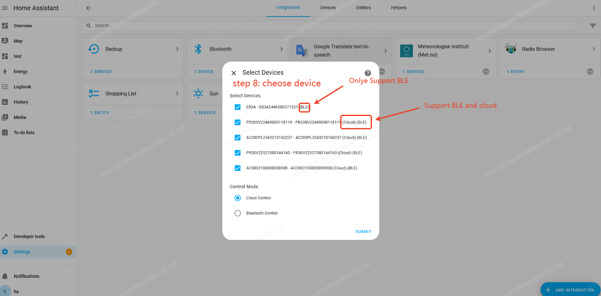

# BLUETTI Integration for Home Assistant

[🇨🇳 简体中文](./README_zh.md) | [🇩🇪 German](./README_de.md) | [🇫🇷 Français](./README_fr.md) | [🇬🇧 English](./README.md) | 
[🇳🇱 Dutch](./README_nl.md) | [🇺🇦 Ukrainian](./README_uk.md)

BLUETTI Power Station Integration is an integrated component of Home Assistant
supported by BLUETTI official. It allows you to use BLUETTI smart Power Station
devices in Home Assistant.

In August 2026, the project formally established a dual-track maintenance model 
with an **Official Edition** and a **Community Edition**. The Community Edition 
is **forked from** the Official Edition's codebase and remains connected to it, 
with a different positioning. Users may choose the appropriate version 
based on their needs. The core differences between the two editions are compared below:

|                     | Official Edition | Community Edition |
| ------------------- | ---------------- | ----------------- |
| **Repository**      | [https://github.com/bluetti-official/bluetti-home-assistant](https://github.com/bluetti-official/bluetti-home-assistant) | [https://github.com/bluetti-community/bluetti-home-assistant](https://github.com/bluetti-community/bluetti-home-assistant) |
| **Maintainer**      | BLUETTI official team | Community-led |
| **Release Cadence** | Conservative, governed by product planning and internal compliance audits | Rapid iteration, open to more feature enhancements and community PRs |
| **Feature Scope**   | Stability and compliance first; new features released after internal review | More flexible; can experiment with new features and new device adapters earlier |
| **Device Support**  | Subject to BLUETTI product planning | Mirrors official device support and adopts community-contributed device adapters |
| **Bug Fixes**       | Fixed and shipped collectively with official releases | Actively fixed by the community |
| **Long-term Positioning** | The only BLUETTI-officially-recognized repository, for users seeking stability | The primary active development hub, for users seeking greater freedom |

> ℹ️ The Official Edition and Community Edition share the same configuration method and account authorization flow. Switching between editions will not result in the loss of device or configuration data.

## ✨ Features

- ✅ Power Switch
- ✅ Inverter Status
- ✅ Battery state of charge (SOC)
- ✅ AC Switch
- ✅ DC Switch
- ✅ Main unit power switch
- ✅ AC ECO
- ✅ DC ECO
- ✅ Work mode switch: Backup, Self-consumption, Peak and Off-Peak
- ✅ Sleep Mode
- ✅ PV Input Power
- ✅ Grid Input Power
- ✅ AC Ouput Power
- ✅ DC Ouput Power

## 🎮 Power Station Support List

> [!NOTE]
>
> More power station models will be added in the future.

| Power Station Model | Buesiness Name | Cloud Control | BLE Control | Inverter Status |  Battery SOC   | AC Switch | DC Switch | power switch | AC ECO | DC ECO | Work mode switch | Sleep Mode | PV Input Power | Grid Input Power | AC Output Power | DC Output Power | 
|:-------------------:|:--------------:|:-------------:|:-----------:|:---------------:|:--------------:|:---------:|:---------:|:------------:|:------:|:------:|:----------------:|:----------:|:--------------:|:----------------:|:---------------:|:---------------:|
|       AC200L        |     AC200L     |       ✅       |      ✅      |                 |       ✅        |     ✅     |      ✅     |             |   ✅    |   ✅    |        ✅         |            |       ✅        |        ✅         |        ✅        |        ✅        |
|       AC200PL       |    AC200PL     |       ✅       |      ✅      |                 |       ✅        |     ✅     |      ✅     |             |   ✅    |   ✅    |        ✅         |            |       ✅        |        ✅         |        ✅        |        ✅        |
|        AC300        |     AC300      |       ✅       |             |                 |       ✅        |     ✅     |      ✅     |             |        |        |        ✅         |            |       ✅        |        ✅         |        ✅        |        ✅        |
|        AC500        |     AC500      |       ✅       |             |                 |       ✅        |     ✅     |      ✅     |             |        |        |        ✅         |            |       ✅        |        ✅         |        ✅        |        ✅        |
|        AP200        |    Apex 200    |       ✅       |      ✅      |                 |      ✅         |     ✅     |           |             |   ✅    |        |        ✅         |     ✅      |       ✅        |        ✅         |        ✅        |        ✅        |
|        AP300        |    Apex 300    |       ✅       |      ✅      |                 |       ✅        |     ✅     |           |             |   ✅    |        |        ✅         |     ✅      |       ✅        |        ✅         |        ✅        |        ✅        |
|       AP300V2       |  Apex 300 V2   |       ✅       |      ✅      |                 |       ✅        |     ✅     |           |             |   ✅    |        |        ✅         |     ✅      |       ✅        |        ✅         |        ✅        |        ✅        |
|      AORA30V2       |   AORA 30 V2   |       ✅       |      ✅      |                 |       ✅        |     ✅     |     ✅     |             |   ✅    |   ✅    |        ✅         |     ✅      |       ✅        |        ✅         |        ✅        |        ✅        |
|      AORA100V2      |  AORA 100 V2   |       ✅       |      ✅      |                 |       ✅        |     ✅     |     ✅     |             |   ✅    |   ✅    |        ✅         |     ✅      |       ✅        |        ✅         |        ✅        |        ✅        |
|       AORA200       |    AORA 200    |       ✅       |      ✅      |                 |       ✅        |     ✅     |     ✅     |             |   ✅    |   ✅    |        ✅         |     ✅      |       ✅        |        ✅         |        ✅        |        ✅        |
|      AORA200V2      |  AORA 200 v2   |       ✅       |      ✅      |                 |       ✅        |     ✅     |     ✅     |             |   ✅    |   ✅    |        ✅         |     ✅      |       ✅        |        ✅         |        ✅        |        ✅        |
|       AORA300       |    AORA 300    |       ✅       |      ✅      |                 |       ✅        |     ✅     |     ✅     |             |   ✅    |   ✅    |        ✅         |     ✅      |       ✅        |        ✅         |        ✅        |        ✅        |
|       AORA320       |    AORA 320    |       ✅       |      ✅      |                 |       ✅        |     ✅     |     ✅     |             |   ✅    |   ✅    |        ✅         |     ✅      |       ✅        |        ✅         |        ✅        |        ✅        |
|      Balco260       |    Balco260    |       ✅       |      ✅      |        ✅        |       ✅        |     ✅     |           |             |        |        |        ✅         |            |       ✅        |        ✅         |        ✅        |                 |
|      Balco500       |    Balco500    |       ✅       |      ✅      |        ✅        |       ✅        |     ✅     |           |             |        |        |        ✅         |            |       ✅        |        ✅         |        ✅        |                 |
|        EB3A         |      EB3A      |               |      ✅      |                 |       ✅        |     ✅     |      ✅     |             |   ✅    |   ✅    |                  |            |       ✅        |        ✅         |        ✅        |        ✅        |
|        EL300        |   Elite 300    |       ✅       |      ✅      |                 |       ✅        |     ✅     |     ✅     |             |   ✅    |   ✅    |        ✅         |     ✅      |       ✅        |        ✅         |        ✅        |        ✅        |
|        EL320        |   Elite 320    |       ✅       |      ✅      |                 |       ✅        |     ✅     |     ✅     |             |   ✅    |   ✅    |        ✅         |     ✅      |       ✅        |        ✅         |        ✅        |        ✅        |
|        EL400        |   Elite 400    |       ✅       |      ✅      |                 |       ✅        |     ✅     |     ✅     |             |   ✅    |   ✅    |        ✅         |     ✅      |       ✅        |        ✅         |        ✅        |        ✅        |
|       EL30V2        |  Elite 30 V2   |       ✅       |      ✅      |                 |       ✅        |     ✅     |     ✅     |             |   ✅    |   ✅    |        ✅         |     ✅      |       ✅        |        ✅         |        ✅        |        ✅        |
|       EL100V2       |  Elite 100 V2  |       ✅       |      ✅      |                 |       ✅        |     ✅     |     ✅     |             |   ✅    |   ✅    |        ✅         |     ✅      |       ✅        |        ✅         |        ✅        |        ✅        |
|    Elite 200 V2     |  Elite 200 V2  |       ✅       |      ✅      |                 |       ✅        |     ✅     |     ✅     |             |   ✅    |   ✅    |        ✅         |     ✅      |       ✅        |        ✅         |        ✅        |        ✅        |
|        EP13K        |     EP13k      |       ✅       |             |        ✅        |       ✅        |           |           |      ✅      |        |        |        ✅         |            |                |                  |                 |                 |
|       EP2000        |     EP200      |       ✅       |             |        ✅        |       ✅        |           |           |      ✅      |        |        |        ✅         |            |                |                  |                 |                 |
|        EP6K         |      EP6k      |       ✅       |             |        ✅        |       ✅        |           |           |      ✅      |        |        |        ✅         |            |                |                  |                 |                 |
|        EP760        |     EP760      |       ✅       |             |        ✅        |       ✅        |           |           |      ✅      |        |        |                  |            |                |                  |                 |                 |
|      EP500Pro       |    EP500Pro    |       ✅       |             |                 |       ✅        |     ✅     |      ✅     |             |        |        |        ✅         |            |       ✅        |        ✅         |        ✅        |        ✅        |
|         FP          | Fridge Product |       ✅       |      ✅      |        ✅        |       ✅        |     ✅     |     ✅     |             |   ✅    |   ✅    |        ✅         |     ✅      |                |                  |                 |                 |
|       PR100V2       | Premium 100 V2 |       ✅       |      ✅      |                 |       ✅        |     ✅     |     ✅     |             |   ✅    |   ✅    |        ✅         |     ✅      |       ✅        |        ✅         |        ✅        |        ✅        |
|       PR200V2       | Premium 200 V2 |       ✅       |      ✅      |                 |       ✅        |     ✅     |     ✅     |             |   ✅    |   ✅    |        ✅         |     ✅      |       ✅        |        ✅         |        ✅        |        ✅        |
|       PR30V2        | Premium 30 V2  |       ✅       |      ✅      |                 |       ✅        |     ✅     |     ✅     |             |   ✅    |   ✅    |        ✅         |     ✅      |       ✅        |        ✅         |        ✅        |        ✅        |
|         RV5         |      RV5       |       ✅       |      ✅      |        ✅        |       ✅        |     ✅     |     ✅     |             |        |        |        ✅         |     ✅      |       ✅        |        ✅         |        ✅        |        ✅        |


## 📦 Integration installation

There are two ways to install `BLUETTI Power Station Integration`.

### Install manually

1. Enter the `Home Assistant` configuration directory

   ```bash
   cd /<ha workspaces>/core/config/custom_components
   ```

2. Clone `BLUETTI Power Station Integration` github repository.

   ```bash
   git clone https://github.com/bluetti-official/bluetti-home-assistant.git
   ```

3. Or download the integrated zip file and extract it to the custom integration
   directory of `Home Assistant`:

   ```bash
   unzip xxx.zip -d /<ha workspaces>/core/config/custom_components/bluetti
   ```

4. Reboot your `Home Assistant` system.

### Install by HACS

As the `BLUETTI Power Station Integration` has not yet been submitted to the
official HACS repository, it is necessary to manually add a custom repository.
HACS itself is a Home Assistant plugin (users need to install HACS first),
similar to an app store. Through this app store, other third-party integrations
can be installed.

1. Follow the steps "HACS -> Integration -> Custom Repository (it is in the
   upper right corner of the page)".

2. Add repository and make the type selection:
   - **Repository**:
     [https://github.com/bluetti-official/bluetti-home-assistant.git](https://github.com/bluetti-official/bluetti-home-assistant.git)
   - **Type:** Integration

3. Then, on the "Integration" page of HACS, you can see the `BLUETTI`
   Integration. Click to install.

4. Finally, Reboot your `Home Assistant` system.

## ⚙️ Integration configuration

1. Follow the steps "Settings -> Devices & services", click to enter the
   `Integration List` page.

   

2. Click the "Add Integration" button, then search for the brand keyword
   `bluetti`; select the `BLUETTI` integration to proceed with the OAUTH
   authorization login.

   

3. You must agree that `Home Assistant` can access your BLUETTI account and
   establish a connection with the BLUETTI cloud service.

   

4. Enter your BLUETTI account to authorize and login.

   

5. You must agree that `Home Assistant` link to your BLUETTI account.

   

6. Select your BLUETTI power station devices that need to be used and managed in
   Home Assistant.

   
   

## 🗑️ Integration removal

1. Go to **Settings -> Devices & services**, open the `BLUETTI` integration
   card, click the three-dot menu on the integration entry and select
   **Delete**. This removes the config entry, its devices and entities from
   `Home Assistant`.

2. Remove the integration files:

   - **Installed via HACS**: go to **HACS -> Integrations**, open `BLUETTI`,
     and select **Remove**.
   - **Installed manually**: delete the `custom_components/bluetti` folder
     from your `Home Assistant` configuration directory.

3. Restart `Home Assistant` to complete the removal.

4. (Optional) If you no longer want `Home Assistant` to have access to your
   BLUETTI account, revoke it from your BLUETTI account's connected-apps
   settings.

## ❓ Frequently Asked Questions (FAQ)

### Not found `BLUETTI Integration` after installation?

Please check whether the `custom_components` path is correct and confirm whether
the `Home Assistant` system has been restarted.

### Always offline or failed connect to BLUETTI server?

Please check the **network**, **ports** and **firewall** to ensure that
`Home Assistant` can access the power station devices.

### How to update the `BLUETTI Integration`?

1. Enter the HACS management page to perform the update.
2. Update using `git`

   ```bash
   cd /<ha workspaces>/config/custom_components/bluetti
   git pull
   ```
   
## Notice

### Balco260 Self-consumption mode need connect the electricity meter

## 📮 Support & Feedback

💬 Have any problems or suggestions? Create an issue on GitHub:
[https://github.com/bluetti-official/bluetti-home-assistant/issues](https://github.com/bluetti-official/bluetti-home-assistant/issues)
